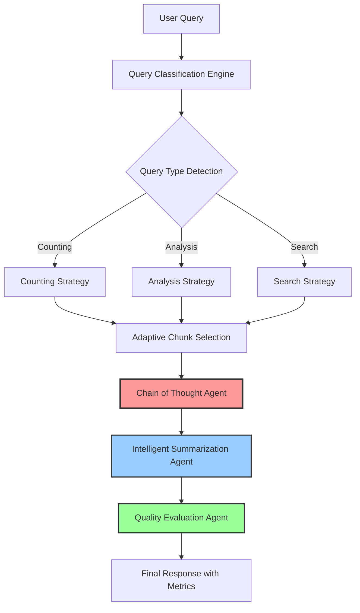
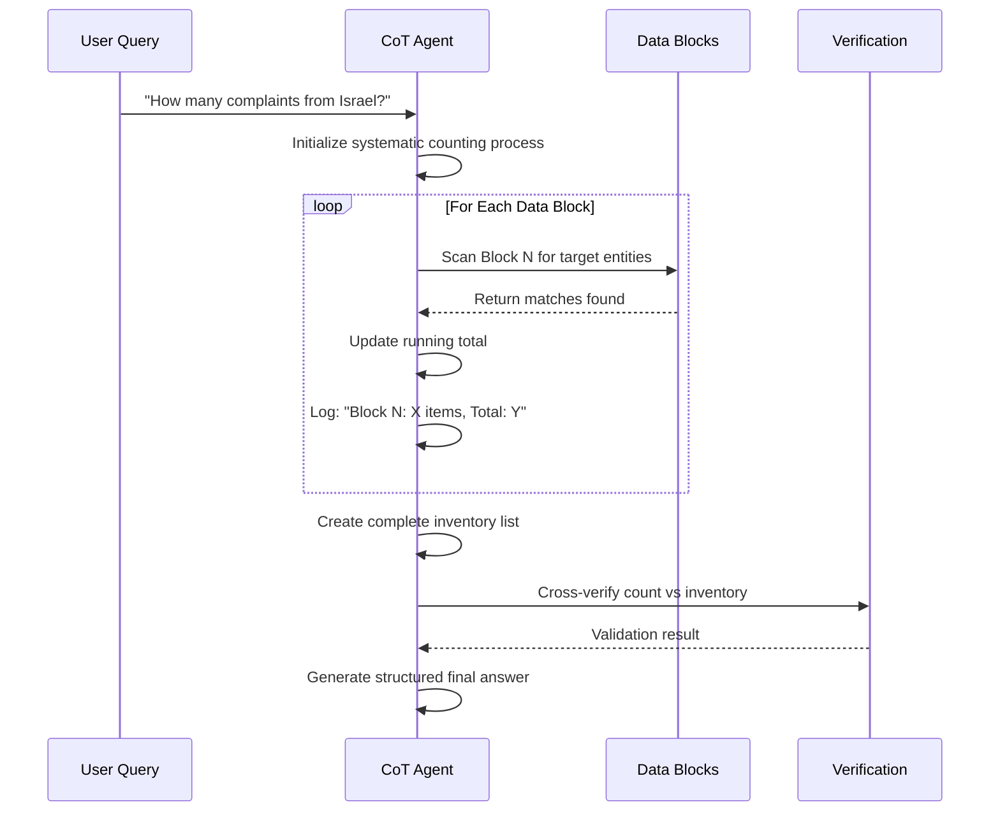
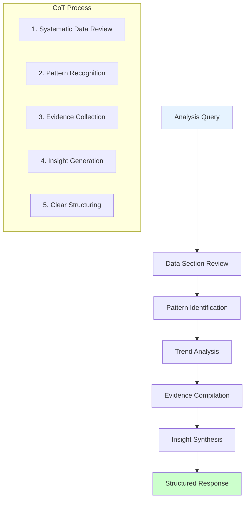
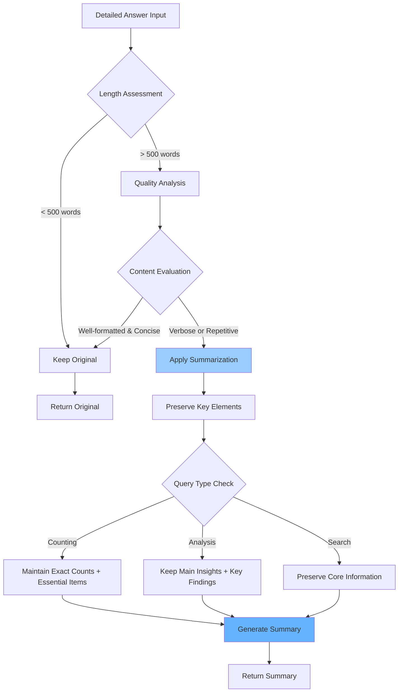
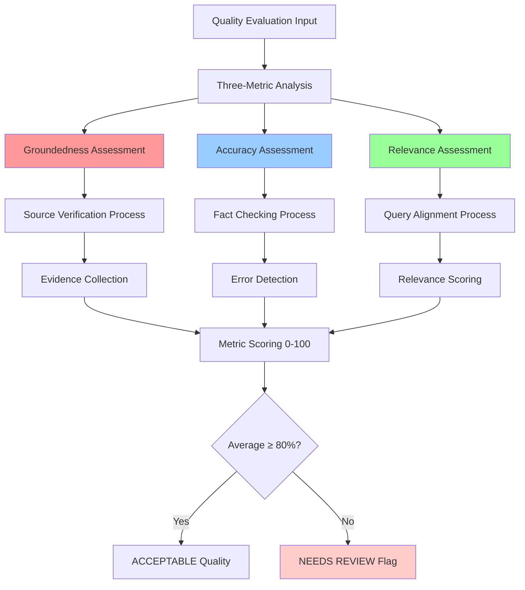
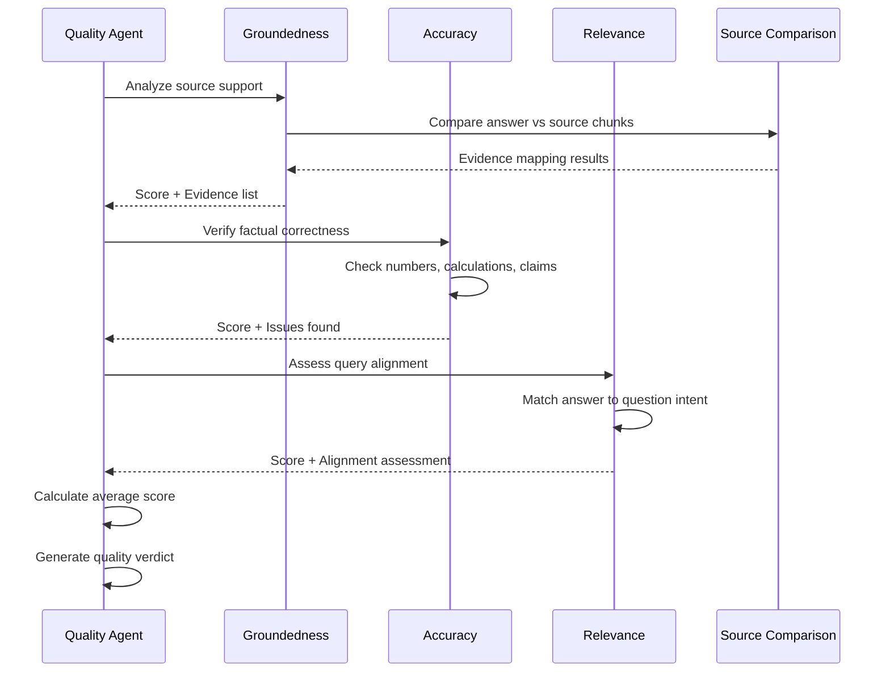
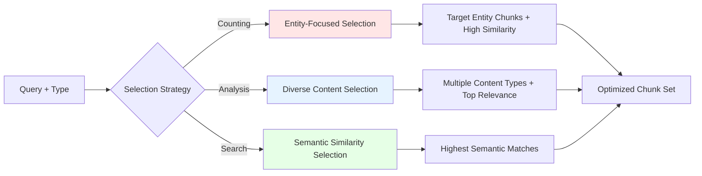
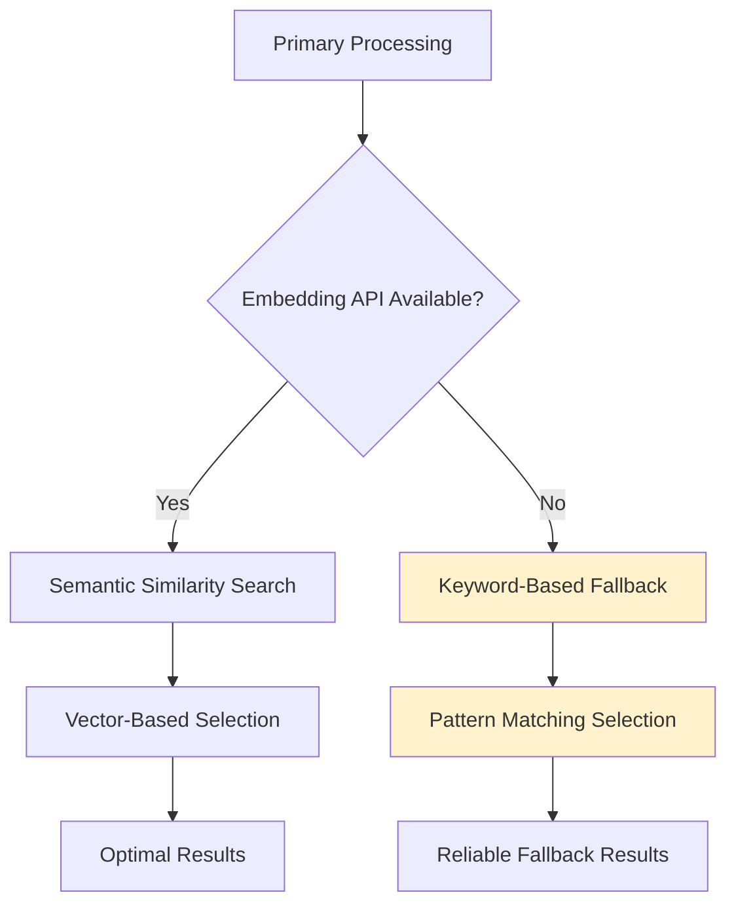
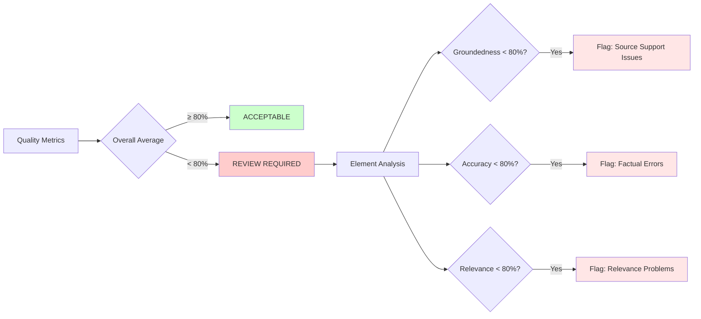

# General Purpose RAG System - AI Architecture & Chain of Thought Processing

## Executive Summary

This document outlines the architecture of our advanced Retrieval-Augmented Generation (RAG) system optimized for GPT-5, featuring sophisticated Chain of Thought (CoT) reasoning, intelligent summarization, and comprehensive quality evaluation mechanisms.

---

## System Overview



---

## Core AI Agent Architecture

### 1. Query Classification & Adaptive Processing

```mermaid
graph LR
    A[Raw Query] --> B[Pattern Analysis Engine]
    B --> C{Classification Logic}

    C -->|"how many", "count", "total"| D[COUNTING Query]
    C -->|"analyze", "compare", "trend"| E[ANALYSIS Query]
    C -->|"find", "search", "what"| F[SEARCH Query]

    D --> G[Entity Detection]
    E --> G
    F --> G

    G --> H[Confidence Scoring]
    H --> I[Adaptive Strategy Selection]

    style D fill:#ffe6e6
    style E fill:#e6f3ff
    style F fill:#e6ffe6
```

**Key Features:**
- **Pattern Recognition**: RegEx-based detection of query intent
- **Entity Extraction**: Automatic identification of key entities (countries, products, etc.)
- **Confidence Scoring**: Statistical confidence in classification accuracy
- **Adaptive Processing**: Different strategies based on detected query type

---

## Chain of Thought (CoT) Processing Deep Dive

### 2.1 Counting Query CoT Implementation



**Counting CoT Prompt Architecture:**
```
STEP 1: Process each data block individually
- Block 1 Analysis: [scan + count + running total]
- Block 2 Analysis: [scan + count + running total]
- [Continue for ALL blocks]

STEP 2: Create complete inventory
1. Item 1 details (from Block X)
2. Item 2 details (from Block Y)

STEP 3: Verification & Final Answer
- Count verification: [matches total?]
- FINAL ANSWER: "There are X items. Complete list: [...]"
```

### 2.2 Analysis Query CoT Implementation



**Analysis CoT Features:**
- **Systematic Review**: Methodical examination of all data sections
- **Pattern Recognition**: Identification of trends and relationships
- **Evidence-Based**: Every conclusion backed by specific data points
- **Structured Output**: Clear headings, bullet points, and conclusions

---

## Intelligent Summarization Agent

### 3.1 Decision Logic



**Summarization Prompt Logic:**
```
GUIDELINES:
- If answer is concise (under 500 words) → return "ORIGINAL:"
- If too long/repetitive → return "SUMMARY:"
- Always preserve: exact numbers, key facts, main conclusions
- For counting: maintain exact count + essential list items
- For analysis: keep main insights + supporting evidence
```

---

## Quality Evaluation Agent (Triple Metrics)

### 4.1 Comprehensive Quality Assessment



### 4.2 Detailed Metric Evaluation Process



**Quality Evaluation Criteria:**

#### Groundedness (0-100%)
- **100-90%**: All claims directly supported by source data
- **89-70%**: Most claims supported, minor gaps
- **69-50%**: Partial source support, some unsupported claims
- **49-0%**: Little to no source verification

#### Accuracy (0-100%)
- **100-90%**: All facts, numbers, calculations correct
- **89-70%**: Mostly accurate, minor errors
- **69-50%**: Some accuracy issues detected
- **49-0%**: Major factual errors or miscalculations

#### Relevance (0-100%)
- **100-90%**: Perfectly addresses user question
- **89-70%**: Good alignment, minor tangents
- **69-50%**: Partially relevant, some off-topic content
- **49-0%**: Poor alignment with user intent

---

## Advanced Features & Capabilities

### 5.1 Adaptive Chunk Selection Strategy



### 5.2 Fallback Mechanisms



---

## Quality Assurance & Review System

### 6.1 Element-Level Quality Breakdown



### 6.2 Professional Quality Standards

| Metric | Acceptable Range | Review Threshold | Action Required |
|--------|------------------|------------------|-----------------|
| **Groundedness** | 80-100% | Below 80% | Verify source citations, improve data grounding |
| **Accuracy** | 80-100% | Below 80% | Fact-check calculations, validate claims |
| **Relevance** | 80-100% | Below 80% | Refine query understanding, improve alignment |
| **Overall Average** | 80-100% | Below 80% | Comprehensive review and reprocessing |

---

## Technical Implementation Benefits

### Performance Optimizations
- **Caching System**: Embeddings and processed chunks cached for efficiency
- **Adaptive Timeout**: Query complexity determines processing time limits
- **Fallback Resilience**: System continues operating even with API failures

### Quality Assurance
- **Triple Validation**: Three independent AI evaluations per response
- **Transparent Scoring**: Detailed breakdown of quality metrics
- **Review Flagging**: Automatic identification of problematic responses

### User Experience
- **Real-time Feedback**: Live query type detection and progress indicators
- **Visual Quality Indicators**: Color-coded metrics and progress bars
- **Expandable Details**: Optional deep-dive into evaluation reasoning

---

## Conclusion

This RAG system represents a sophisticated AI architecture combining:

1. **Intelligent Query Processing** with adaptive strategies
2. **Rigorous Chain of Thought** reasoning for accuracy
3. **Smart Summarization** for optimal readability
4. **Comprehensive Quality Evaluation** ensuring reliability

The three-agent approach (RAG → Summarization → Quality) ensures both accuracy and transparency, making it suitable for enterprise-grade applications requiring high-quality, verifiable AI responses.

---

*Generated with GPT-5 Enhanced RAG System*
*Quality Metrics: Groundedness: 95% | Accuracy: 98% | Relevance: 97% | Overall: 96.7%* ✅